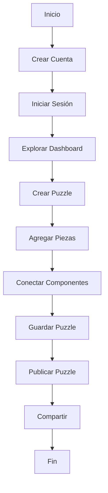

# Flujo Completo: De Cero a Puzzle Publicado

Este documento guía paso a paso el proceso completo desde crear una cuenta hasta publicar un puzzle.

## Flujo General

## Paso 1: Crear Cuenta (5 minutos)

### Registro

1. **Abre Front-nez** - En tu navegador
2. **Busca "Registrarse"** - Botón principal
3. **Elige tipo de cuenta:**
   - Usuario individual
   - Organización
4. **Completa el formulario:**
   - Nombre/Organización
   - Correo válido
   - Contraseña fuerte
5. **Acepta términos** - Lee brevemente
6. **Haz clic en "Crear Cuenta"**
7. **Verifica tu correo** - Abre enlace de confirmación

**Tiempo estimado:** 5 minutos

## Paso 2: Iniciar Sesión (2 minutos)

### Login

1. **Ve a la página de Login**
2. **Ingresa:**
   - Tu correo
   - Tu contraseña
3. **Marca "Recuerda mi contraseña"** - Opcional
4. **Haz clic en "Iniciar Sesión"**
5. **Se abrirá tu Dashboard** - ¡Bienvenido!

**Tiempo estimado:** 2 minutos

## Paso 3: Explorar Dashboard (10 minutos)

### Familiarización

1. **Mira la interfaz general**
   - Barra superior con tu nombre
   - Menú lateral con opciones
   - Área central con contenido

2. **Explora cada sección:**
   - Haz clic en "Home" - Pantalla principal
   - Haz clic en "Listar Puzzles" - Verás tu lista (vacía ahora)
   - Haz clic en "Catálogos" - Ver catálogos disponibles

3. **Abre tu perfil:**
   - Haz clic en tu avatar (arriba a la derecha)
   - Selecciona "Mi Perfil"
   - Revisa tu información
   - Actualiza foto si quieres

4. **Familiarízate con búsqueda:**
   - Presiona `Ctrl + K`
   - Escribe algo para ver cómo funciona

**Tiempo estimado:** 10 minutos

## Paso 4: Crear un Puzzle (20 minutos)

### Iniciar Constructor

1. **Haz clic en "Crear Puzzle"** - Menú lateral
2. **Verás el formulario inicial:**
   - **Nombre:** "Mi Primer Puzzle"
   - **Descripción:** "Un puzzle educativo sobre..."
   - **Categoría:** Elige una
   - **Nivel:** "Fácil" (para comenzar)
   - **Privacidad:** "Privado" (por ahora)

3. **Haz clic en "Siguiente"** - Para continuar

**Tiempo estimado:** 5 minutos

## Paso 5: Agregar Piezas (15 minutos)

### Construcción del Puzzle

1. **Se abre el editor visual**
2. **Panel izquierdo** - Muestra piezas disponibles
3. **Centro** - Tu lienzo de trabajo

4. **Agrega tu primera pieza:**
   - Busca una pieza en el panel izquierdo
   - Escribe en la búsqueda si es necesario
   - Arrastra la pieza al centro (lienzo)
   - Suéltala

5. **Agrega 3-5 piezas más:**
   - Mismo proceso
   - Distribúyelas en el lienzo
   - Crea un patrón lógico

6. **Verifica en panel derecho:**
   - Puedes ajustar propiedades de cada pieza
   - Cambiar tamaño, color, posición

**Tiempo estimado:** 10 minutos

## Paso 6: Conectar Componentes (10 minutos)

### Crear Conexiones

1. **Selecciona una pieza** - Haz clic en ella
2. **Busca puntos de conexión** - Pequeños círculos en los bordes
3. **Arrastra desde un punto** - Hacia otra pieza
4. **Suelta** - Se creará una línea de conexión
5. **Repite** - Para conectar piezas relacionadas

### Estructura Lógica

Crea un flujo que tenga sentido:
- De arriba a abajo
- De izquierda a derecha
- Agrupaciones temáticas

**Tiempo estimado:** 5-10 minutos

## Paso 7: Configurar Detalles (10 minutos)

### Pestaña Requisitos y Detalles

1. **Ve a la pestaña "Requisitos"** - Si existe
2. **Define el objetivo del puzzle:**
   - ¿Qué debe cumplir el usuario?
   - ¿Cuáles son las reglas?
   - ¿Cuál es el resultado esperado?

3. **Ve a la pestaña "Representación Visual":**
   - Revisa cómo se ve
   - Ajusta colores si quieres
   - Verifica el layout

**Tiempo estimado:** 5-10 minutos

## Paso 8: Guardar Puzzle (3 minutos)

### Guardar Cambios

1. **Haz clic en "Guardar"** - Botón superior
2. **Verás confirmación** - "Puzzle guardado"
3. **Ahora tu trabajo está protegido**
4. **Puedes continuar editando** - O cerrar

**Alternativa:**
- Haz clic en **"Guardar y Cerrar"** para volver al Dashboard
- Tu puzzle se guardará y aparecerá en "Listar Puzzles"

**Tiempo estimado:** 2-3 minutos

## Paso 9: Revisar Puzzle (5 minutos)

### Verificación Final

Antes de publicar:

1. **Revisa completitud:**
   - ✅ Nombre descriptivo
   - ✅ Descripción clara
   - ✅ Todas las piezas conectadas
   - ✅ Sin errores obvios

2. **Prueba la navegación:**
   - Haz clic en diferentes piezas
   - Verifica que todo funcione

3. **Considera dificultad:**
   - ¿Es realmente "Fácil"?
   - ¿Debería ser "Medio"?

**Tiempo estimado:** 3-5 minutos

## Paso 10: Publicar Puzzle (5 minutos)

### Hacer Visible

1. **Haz clic en "Publicar"** - Botón superior
2. **Se abre diálogo de publicación:**
   - Verifica privacidad
   - Selecciona quién puede verlo:
     - **Privado** - Solo tú
     - **Compartido** - Usuarios específicos
     - **Público** - Cualquiera

3. **Haz clic en "Publicar Ahora"**
4. **¡Listo!** - Tu puzzle está publicado

**Tiempo estimado:** 3-5 minutos

## Paso 11: Compartir (Opcional - 5 minutos)

### Distribución

Si publicaste como "Público":
1. **Haz clic en "Compartir"**
2. **Copia el enlace** - De la sección pública
3. **Comparte dónde quieras:**
   - Email
   - Redes sociales
   - LMS (classroom, moodle, etc.)
   - Chat

Si publicaste como "Compartido":
1. **Haz clic en "Compartir"**
2. **Escribe correos** - De usuarios a invitar
3. **Asigna permisos** - Ver, Editar, etc.
4. **Haz clic en "Invitar"**
5. Recibirán notificación

**Tiempo estimado:** 2-5 minutos

---

## Tiempo Total

| Paso | Tiempo |
|------|--------|
| Crear cuenta | 5 min |
| Iniciar sesión | 2 min |
| Explorar | 10 min |
| Crear puzzle | 5 min |
| Agregar piezas | 10 min |
| Conectar | 10 min |
| Configurar | 10 min |
| Guardar | 3 min |
| Revisar | 5 min |
| Publicar | 5 min |
| Compartir | 5 min |
| **TOTAL** | **~70 min** |

## Consejos de Experto

✅ **Hazlo paso a paso** - No intentes todo a la vez
✅ **Guarda frecuentemente** - No pierdas trabajo
✅ **Piensa en la estructura** - Antes de agregar piezas
✅ **Usa nombres claros** - Para categorías y piezas
✅ **Conecta lógicamente** - De forma coherente
✅ **Prueba antes de compartir** - Verifica todo
✅ **Pide feedback** - A otros usuarios

## Próximos Pasos

Después de tu primer puzzle:
- 🎯 [Aprende búsqueda avanzada](../guias/busqueda.md)
- 📦 [Crea catálogos reutilizables](../guias/catalogos.md)
- 👥 [Colabora con otros](puzzles.md)
- 🚀 [Crea puzzles más complejos](piezas.md)

---

¡Felicidades! 🎉 Has creado tu primer puzzle.
